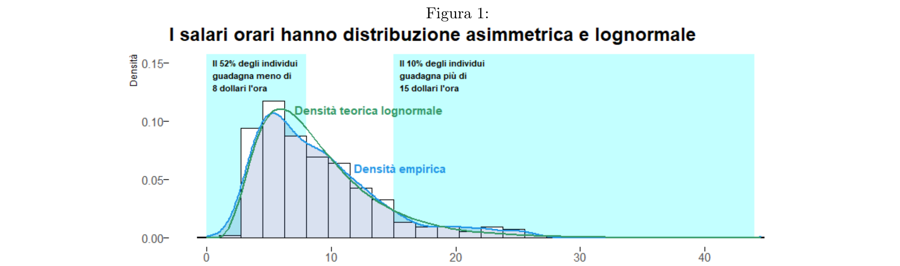
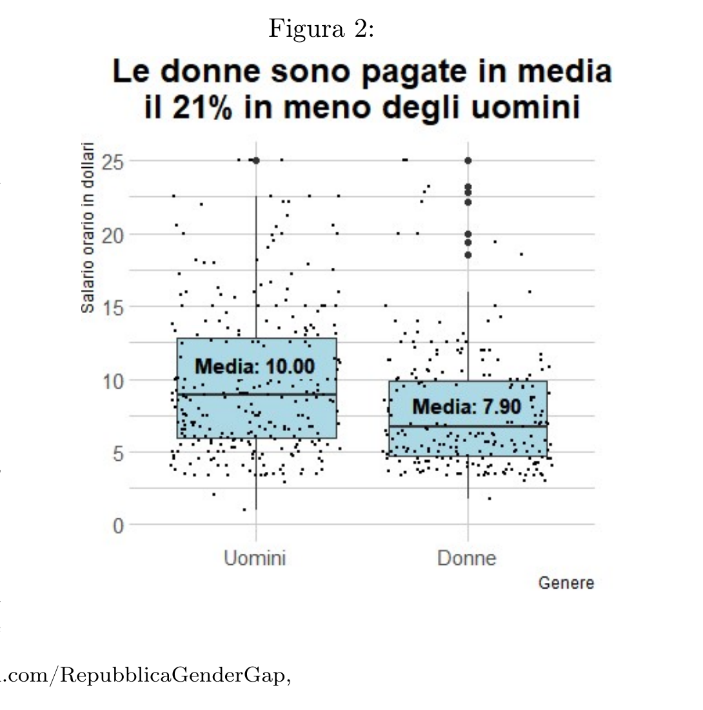
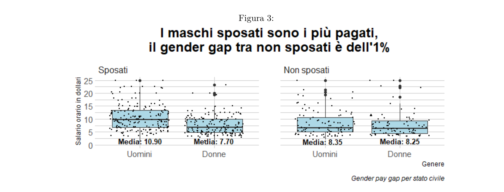
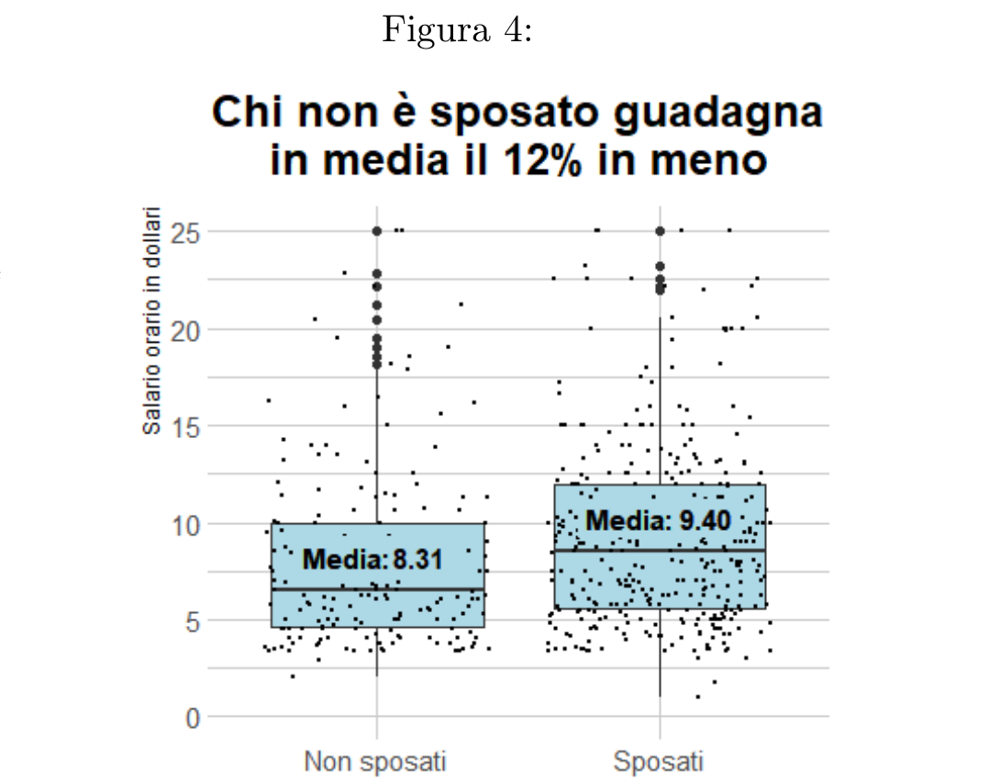
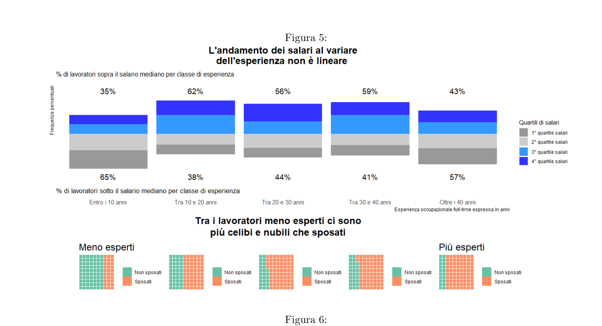
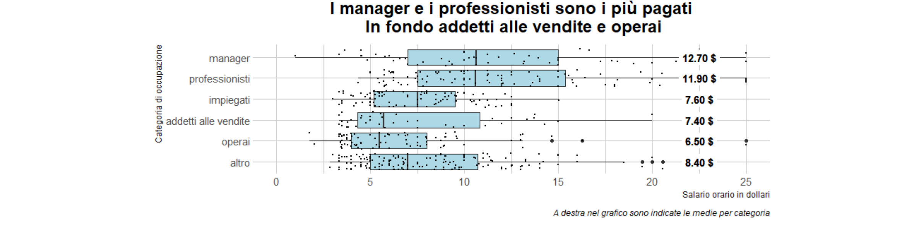
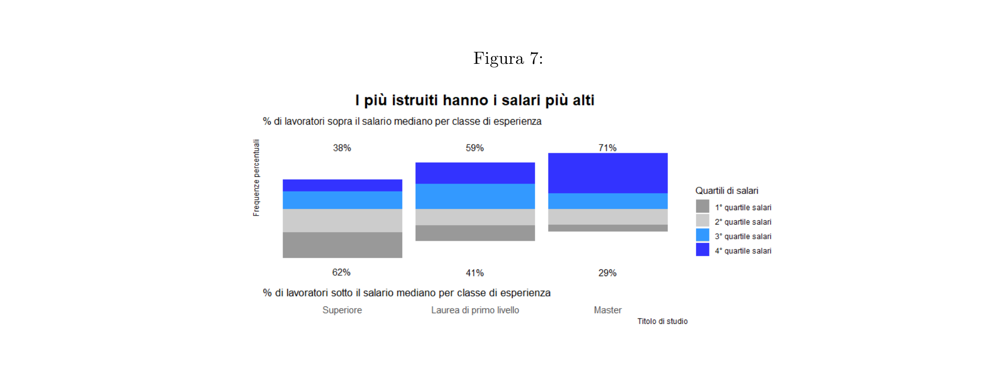
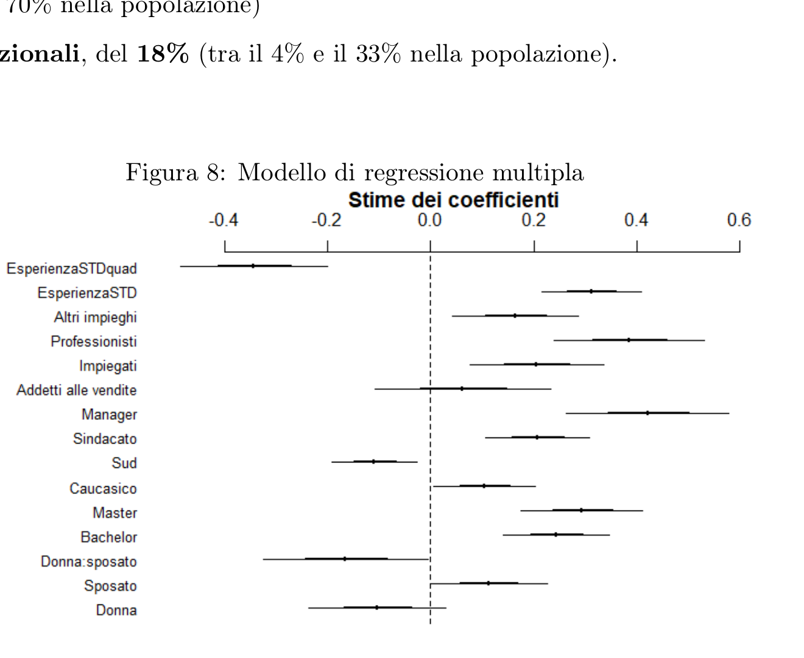
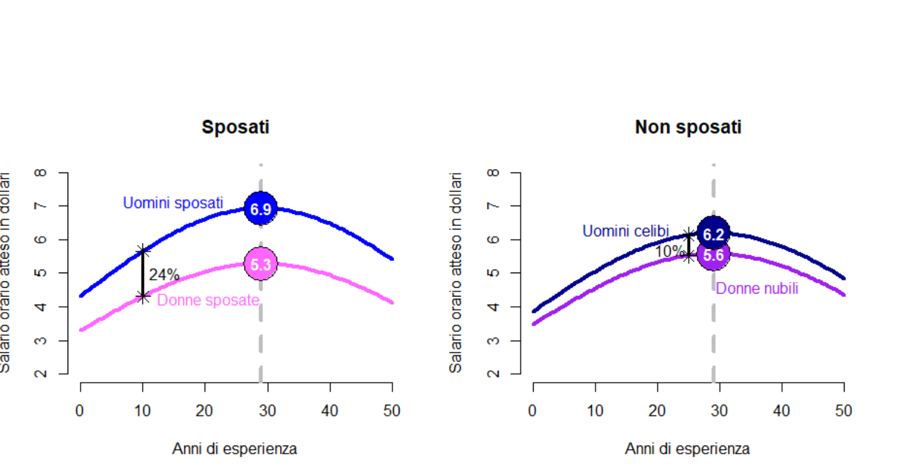
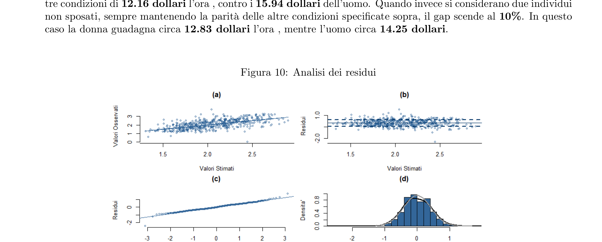

# "Женись стариком, никуда не годным... А то пропадет все, что в тебе есть хорошего и высокого"
### "Marry when you're an old man, no good for anything anymore... otherwise everything beautiful and noble in you will be lost" — Leo Tolstoy, *War and Peace*

*Federica Masci, Leonardo Rosetti, Luca Romano, Francesco Virgili, Marina Zanoni, Francesco Politano*
*November 25, 2022*

Women earn less than men — decisively less. The law is the same for everyone, and so are contracts, but over the course of a working life, careers, career interruptions, and choices made or imposed mean that this formal equality is only apparent. This is why the term **gender pay gap** was coined: the difference, for the same job, between a man's and a woman's pay.

Women face greater difficulty than men in balancing work and personal life (*work-life balance*), especially once married. A frequent choice for women is part-time work, which many take on to reconcile employment with family responsibilities.¹ As a result, women experience more career interruptions than men, or work fewer hours, which can have negative repercussions on career advancement and promotion opportunities.

Tolstoy wrote in *War and Peace*: "Marry when you're an old man, no good for anything anymore, otherwise everything beautiful and noble in you will be lost." In light of everything said so far about the gender gap, and considering that Tolstoy was addressing a man, would this advice still hold for men today, or would it be more fitting advice for women? We explore the theme of the gender pay gap and its relationship with marriage by analyzing a sample of data from the 1985 *Current Population Survey*.

A first look at the distribution of wages in the sample (Figure 1) immediately reveals the classic log-normal shape, indicating a large share of individuals with medium-low hourly wages (more than 50% of respondents earn less than $8/hour) and a smaller share of individuals with high wages (only 10% earn more than $15/hour).

The skewness of the distribution is confirmed by the index² α₁ = 0.24. This value also reveals a distortion in the summary offered by the mean wage, which is $9/hour — 16% higher than the median.

**Figure 1:** Hourly wages have an asymmetric, log-normal distribution

To investigate wage differences between men and women, and between married and unmarried individuals, we start with a purely descriptive analysis of the relationships between the variables involved.

Since equal conditions between men and women are not guaranteed, the raw wage gap is 21% (Figure 2): men's average hourly wage is $10, versus about $7.90 for women. Moreover, only 5% of women earn more than $15/hour, versus 15% of men.

**Figure 2:** On average, women are paid 21% less than men

Analyzing the gender pay gap separately for married and unmarried individuals (Figure 3) produces a striking result. Among the never-married, the gap is only 10 cents an hour in favor of men, while among the married, the gap exceeds $3, i.e., women earn 29% less.

This might suggest an absence of gender discrimination among singles. However, as will become clear once we control for other variables, this is the result of a series of confounding effects. In particular, the role of **experience** (expressed as years of full-time work) turns out to be important, since among the unmarried it is on average more than 50% higher for women. This is confounding because experience is associated with both gender and marital status, and, at the same time, with wages themselves, which grow with experience up to a peak and then decline slowly (as we will see, we can hypothesize a quadratic relationship between the two variables).

**Figure 3:** Married men are the highest paid; among the unmarried, the gender gap is just 1%

Looking at the wage difference by marital status (Figure 4), unmarried individuals earn on average about 12% less than married ones ($8.31 versus $9.40/hour). The picture changes, however, between genders (Figure 3): married men earn on average about $2.50 more (+30%) than unmarried men, while for women the difference is actually reversed — married women earn on average about 60 cents less (−7%) than never-married women. Here too, though, other variables need to be controlled for: experience is again a confounder, since married individuals have on average 7 more years of experience than others, and, as noted above, experience is also associated with wages.

**Figure 4:** Unmarried individuals earn 12% less on average

Looking at the data on experience and wages (Figure 5), we see that wage levels, after the first few years of work, rise rapidly and then decline slightly beyond 40 years. Given the confounding role of marital status and gender, it is interesting to use the fully-controlled model to determine whether there really is a quadratic relationship. It is plausible that the largest career jumps (and hence the largest wage increases) occur in the early years of work, and that once a certain experience threshold is crossed, career progression slows, leading to a stabilization (and possibly slight decline) in wages.

**Figure 5:** Wages do not vary linearly with experience

Regarding ethnic discrimination, the average wage of individuals of non-Caucasian ethnicity is 15% lower than that of the majority group: about $7.80/hour versus $9.30. The best-paid occupational category on average is **managers** ($12.70/hour), followed by **professionals** ($11.90). The "other" category averages $8.40, followed by **sales workers** ($7.60) and **clerical workers** ($7.40). Finally, the **blue-collar** occupational category shows the lowest average hourly wage ($6.50). The significant differences are therefore between the top 2 professions and all the others (see Figure 6).

**Figure 6:** Managers and professionals are paid the most; sales workers and blue-collar workers the least

The data show a fairly strong association between wages and education (Figure 7): more than 62% of those who never enrolled in a degree program (basic education) have a wage below the median, while among those who completed undergraduate and graduate degrees, respectively 59% and 71% have a wage above the median.

**Figure 7:** More educated workers have higher wages

Focusing specifically on gender wage differences, we estimate a simple regression model with sex as the linear predictor:

$$\begin{array}{l} \log(\text{wage}) = \underset{(0.030)}{2.165} - \underset{(0.045)}{0.231}\cdot\text{female} \end{array}$$

Based on the growth-rate estimates from this model, women earn on average 21% less than men (the previously derived averages are indeed $7.90/hour for women versus $10/hour for men). The difference is statistically significant at the 95% level, and logically significant given the large body of economic research on the gender pay gap.

$$\begin{array}{l} \log(\text{wage}) = \underset{(0.039)}{1.960} + \underset{(0.048)}{0.151}\cdot\text{married} \end{array}$$

This simple regression on marital status estimates the average wage difference by marital status at 16%: the average wage for unmarried individuals is $8.31/hour, while for married individuals it is $9.40/hour on average. The difference is statistically significant at the 95% level. The result is also logically significant: the study "Married Men Sit Atop the Wage Ladder" shows that married individuals earn more on average (particularly men).

Note that in both models we are not applying any controls — that is, we are not holding other conditions equal, and therefore we cannot yet draw any general conclusion about the "effect" of these predictors on wages.

We therefore move on to a model that adds the relevant controls:

$$\begin{array}{l} \log(\text{income}) = \underset{(0.079)}{1.753} + \underset{(0.048)}{0.311}\cdot\widetilde{\text{exp}} - \underset{(0.071)}{0.343}\cdot\widetilde{\text{exp}}^2 - \underset{(0.066)}{0.105}\cdot\text{female} \\ + \underset{(0.057)}{0.112}\cdot\text{married} - \underset{(0.080)}{0.165}\cdot\text{female}\!:\!\text{married} + \underset{(0.051)}{0.244}\cdot\text{bachelor} + \underset{(0.059)}{0.293}\cdot\text{master} + \underset{(0.050)}{0.104}\cdot\text{caucasian} \\ - \underset{(0.041)}{0.110}\cdot\text{south} + \underset{(0.051)}{0.207}\cdot\text{union} + \underset{(0.079)}{0.421}\cdot\text{manager} + \underset{(0.085)}{0.062}\cdot\text{salesWorker} \\ + \underset{(0.065)}{0.205}\cdot\text{clerical} + \underset{(0.073)}{0.385}\cdot\text{professional} + \underset{(0.061)}{0.164}\cdot\text{otherOccupation} \end{array}$$

The experience predictor (standardized using twice its standard deviation) is also included as a quadratic term, while ethnicity is treated as a dichotomous variable given the small sample sizes for categories other than Caucasian.

We define the baseline as a male blue-collar worker, non-Caucasian, residing in the North, with about 18 years of work experience, unmarried, and with basic education (i.e., at most a high-school diploma).

The intercept represents the expected log-wage of our baseline individual, corresponding to an expected hourly wage of $5.77.

For all the following interpretations of the control coefficients, all else is held equal except for the predictor under discussion. To make the coefficients interpretable, they have been reworked and converted into **"growth rates."**³

The expected wage of an individual who has at least enrolled in college (without going beyond an undergraduate degree) is 28% higher than that of someone with basic education. That expected difference rises to 34% when someone with basic education is compared with an otherwise identical individual who has at least enrolled in a graduate program. Both coefficients are statistically and logically significant: they show that, in the 1985 US employed population, all else equal, those who went beyond secondary school earn a higher hourly wage — between 15% and 41% more with a bachelor's degree, and between 19% and 51% more if they went further. It is well established that higher educational attainment is associated with higher wages: the coefficients for bachelor's and master's degrees are therefore economically significant.

Even after controlling for the other variables and holding all else equal (as for every other coefficient), the expected hourly wage of a **Caucasian** worker is **11% higher** than that of an otherwise identical individual of a different ethnicity. This difference is statistically significant and can therefore be used to make inferences about the entire 1985 US labor market (the expected population-level difference lies between 1% and 23%). The coefficient is certainly logically significant, given the well-documented presence of discrimination against non-Caucasian ethnicities in countries like the US.

We also observe that a **worker in the South** is paid less than one in the North: the expected hourly wage difference here is **10% lower**, to the disadvantage of Southern workers. Knowing that the northern US is wealthier than the South, the coefficient is logically as well as statistically significant. For the entire US employed population, the expected wage disadvantage of a Southern worker lies between 3% and 17%.

Being a **union member** is an advantage in terms of expected hourly wage relative to other workers. This advantage is 23% in the sample. Union support logically plays a positive role in hourly wage bargaining for an employee, so this coefficient can be considered economically significant. It is also statistically significant: among US workers, all else equal (as stated above), union members are paid on average between 11% and 36% more than non-members.

Among **occupational categories**, the reference category is blue-collar workers. Using growth rates (derived from the regression coefficient estimates), we can assess the expected wage difference between them and other groups of workers. All the coefficient estimates are positive, which is logically significant, since we would expect blue-collar workers to be the lowest-paid category relative to all others.

We observe that **sales workers** have, in the sample, an expected hourly wage **6% higher** than blue-collar workers. We cannot, however, conclude that this difference generally holds, since the coefficient is not statistically significant.

We can instead state that, both in the sample of respondents and in the population, the following groups earn more than blue-collar workers, all else being equal:

- **managers**, by 52% (between 30% and 78% in the population)
- **clerical workers**, by 23% (between 8% and 40% in the population)
- **professionals**, by 47% (between 27% and 70% in the population)
- workers in **other occupational categories**, by 18% (between 4% and 33% in the population)

**Figure 8:** Multiple regression model — coefficient estimates

Let's now consider the model's key variables: the coefficient for the **female** variable is estimated at −0.105. In terms of growth rate, this indicates that, between two unmarried individuals, all else being equal (years of experience, education level, ethnicity, residing in the South, union membership, occupational category), **a woman earns 10% less than a man** (the coefficient is not statistically significant, however, so we cannot conclude that a "gender pay gap" exists in the US population, all else equal, for unmarried individuals). Still, the fact that unmarried women in the sample are, all else equal, paid less than men is economically significant, given the large body of research demonstrating the existence of gender wage differentials of this sign.

Between two otherwise-identical **men** differing only in marital status, the **married** one has an expected wage **12% higher** than the unmarried one. This coefficient is statistically significant, allowing inference about the 1985 US population. Its logical significance is supported by research such as the 2016 study "Married Men Sit Atop the Wage Ladder." It is not possible, however, to interpret the interaction coefficient between gender and marital status while holding one of those two dichotomous variables constant. Its estimate lets us distinguish the expected "gender pay gap," ceteris paribus, among the unmarried from that among the married. In terms of the percentage disadvantage of women relative to men in expected hourly wage, the first of the two gaps (**unmarried**) is, as reported above, 10%, while the second (**married**) is **24%**. As anticipated in the introduction, and as seen from the conditional means, among the married the gender pay gap would be larger because of the notably higher wages that married men receive relative to every other combination of gender and marital status (logical significance). The coefficient is also statistically significant, so we can state that, in the 1985 United States, the expected "gender pay gap," all else equal, is larger among the married than among the unmarried.

The trend of wages with experience follows, according to the model estimates, that of a parabola: the coefficient of $\widetilde{\text{exp}}^2$ is statistically significant, so even for the general population we can reject the null hypothesis of a linear relationship between wages and experience, all else equal. The parabola is concave downward, which is economically significant. As anticipated, we would expect the expected wage difference for a 10-year difference in full-time work experience not to be constant, but larger when comparing two individuals with, say, 5 and 15 years of experience than when comparing two workers with 25 versus 35 years. This requires, if the relationship is parabolic, a vertex that is a maximum (i.e., downward concavity).

The model estimates the vertex of the parabola at a standardized experience value of −0.45. Translating back to the experience scale in years, this means that, up to age 29 (in years of experience), the curve of expected hourly wages as a function of experience, ceteris paribus, would be increasing. From that point on, the trend would be decreasing.

Comparing the curves for men and women across both marital-status categories, it is clear that the gender pay gap is noticeably larger among the married. Indeed, a **married** woman, non-Caucasian, working as a blue-collar worker, not a union member, residing in the North, with basic education (the baseline category) and 29 years of experience, earns on average **$1.60 less** than an otherwise identical man. Among **unmarried** individuals (with the same characteristics), a woman's expected hourly wage is only **60 cents less** than a man's.

So, in general, we observe that married men are the best-paid category overall, while married women are the category with the lowest wages. Moreover, while marriage is more "profitable" for **men** (+12% in terms of expected hourly wage), the trend reverses for **women**, since never-married women have an expected wage 5.5% higher than the rest.

**Figure 9:** Expected wage curves for men and women as experience varies

Thanks to the regression model's estimates, we can make predictions about the expected wage for particular categories of individuals. Specifically, we considered the case of a man and a woman, both with 20 years of full-time work experience, a higher education degree, Caucasian ethnicity, union members, and residing in the South, comparing their expected wages first assuming they are married, and then assuming they are not. The gender pay gap between these two hypothetical married individuals is **24%**: this is the expected share of pay lost by the woman, who would have an average wage, all else equal, of **$12.16/hour**, versus **$15.94** for the man. When instead we consider two unmarried individuals, keeping all the other conditions specified above equal, the gap drops to **10%**. In this case the woman earns about **$12.83/hour**, while the man earns about **$14.25**.

**Figure 10:** Residual diagnostics

The model diagnostics (Figure 10) clearly show symmetry in the residual distribution, in panel (d). In addition, panels (a) and (b) show no visible pattern, indicating no correlation between fitted values and residuals; the assumptions of homoscedasticity and non-correlation therefore hold, and there is no statistical evidence to reject the model.

As this analysis also confirms, the fight against pay inequality between men and women continues to move slowly. Nevertheless, as summarized in an article from Corriere L'Economia, the pay gap is, in every respect, a popular battle. It is well known (and confirmed here too) that the pay gap actually widens when comparing a married woman and a married man, all else being equal. According to the World Economic Forum, the pay gap will not be closed for another 257 years.⁴

---

¹ Sources: https://tinyurl.com/DifferenzeSalfiscoetasse, https://tinyurl.com/RepubblicaGenderGap, https://tinyurl.com/EUComDivarioSalariale
² The index is calculated as the ratio of the difference between mean and median to the standard deviation, α₁ = (μ − m) / σ
³ growth rate = e^β̂ − 1
⁴ Source: https://tinyurl.com/ValoredDispSal
