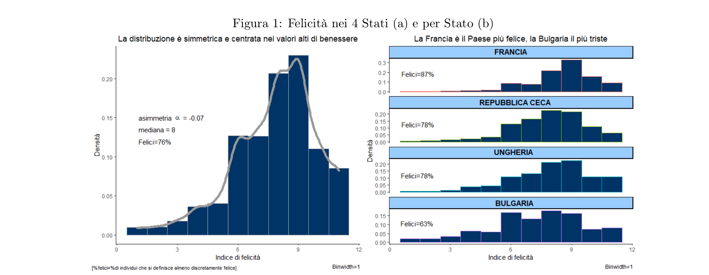
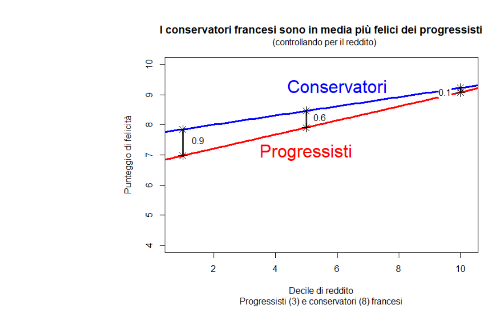
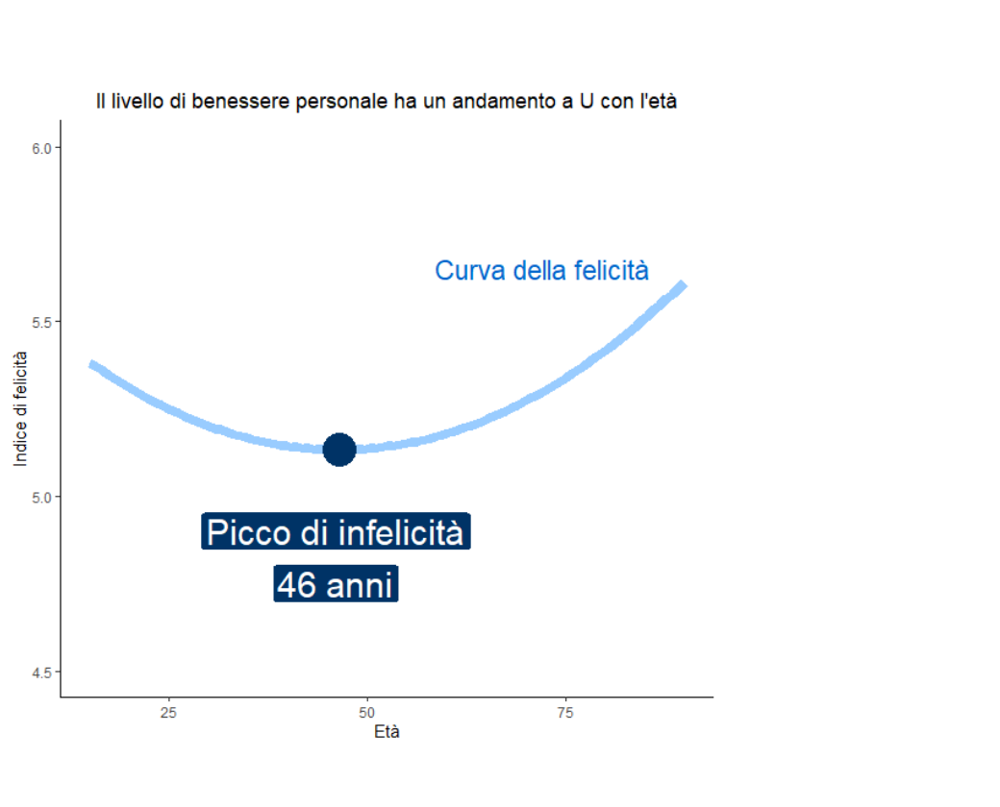
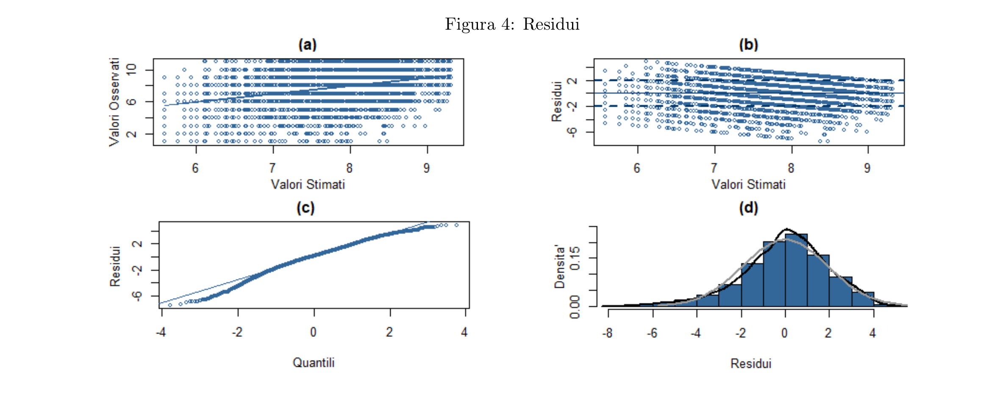

# Pauper ubique iacet
### "The poor always fare badly"

*Federica Masci, Leonardo Rosetti, Luca Romano, Francesco Virgili, Marina Zanoni, Francesco Politano*
*December 25, 2024*

The Greek word for happiness is "eudaimonia," which in its original meaning translates to "having a good Daimon" — that is, being inhabited by a divine presence able to secure a materially prosperous life. In this sense, those men, cities, or regions with high material well-being were considered happy. Does this still hold true today?

The European Social Survey (ESS) is based on cross-sectional observational micro-data, which therefore does not guarantee equal conditions across individuals, nor the absence of confounding factors, since the sample was not collected by splitting it into a treatment and a control group. We therefore cannot speak of a causal relationship, and the research question must be reformulated as: *"All else being equal — controlling for relevant factors — can we say that, on average, income drives differences in the level of happiness?"*

**Figure 1:** Happiness across the 4 countries (panel a) and by country (panel b)

As Figure 1 (panel a) shows, the distribution of happiness levels across the countries considered (France, Czech Republic, Hungary, and Bulgaria) is essentially symmetric (skewness coefficient α₁ = −0.08). The mode is 9 ("happy"), and the mean and median are both around 8 ("fairly happy"), so overall happiness levels are generally high (only 11% of respondents consider themselves "unhappy," with a well-being score below 6).

Comparing countries (Figure 1, panel b), **France** is the country where respondents report being **happiest** (87% describe themselves as at least "fairly happy"), while **Bulgaria** has the lowest share of happy respondents (only 63% describe themselves as at least "fairly happy"). The average personal well-being of individuals in the Czech Republic and Hungary falls halfway between these two countries. We consider a multiple regression model with an interaction term to study the effect of income on happiness and how that effect changes depending on the respondent's political orientation.

$$\begin{array}{l} \text{happiness} = \underset{(0.05)}{8.38} + \underset{(0.05)}{1}\cdot\widetilde{\text{income}} + \underset{(0.05)}{0.49}\cdot\widehat{\text{polLeaning}} - \underset{(0.10)}{0.43}\cdot\widetilde{\text{income}}\cdot\widehat{\text{polLeaning}} \\ - \underset{(0.07)}{0.48}\cdot\text{CZ} - \underset{(0.08)}{0.41}\cdot\text{HU} - \underset{(0.07)}{1.04}\cdot\text{BG} \end{array}$$

Here, $\widehat{\text{polLeaning}}$ is the (standardized) political orientation, $\widetilde{\text{income}}$ is the standardized income decile, and HU, BG, CZ are dummy variables indicating whether the respondent lives in Hungary, Bulgaria, or the Czech Republic (France is the baseline).

To assess the overall "effect" of income on happiness, we need to consider both the interaction term and the coefficient of the $\widetilde{\text{income}}$ variable. In general, the "effect" of income is positive for every value of the political-orientation variable, all else (country of residence) being equal. Specifically, among those who identify as **far-left**, income has the strongest impact on happiness: between two individuals in the same country with a 5-decile difference in income, the richer one is on average **1.4 points** happier. This "effect" weakens among more conservative citizens: among those with a far-right political orientation, the "effect" of the same 5-decile income difference on happiness is, on average, only **0.6 points**. Finally, individuals with an average political-orientation score (centrists, with a value of 6 on the measurement scale) show an intermediate "effect" (equal to an expected **1-point** difference in well-being between two individuals with a 5-decile income difference).

It should be noted that among respondents in the fifth (median) income decile, **conservatives** are, all else being equal, **on average happier than progressives**: a far-right respondent has an expected happiness score **1 point higher** than a far-left one.

We can also assess the effect of political orientation on happiness, holding income and country constant: among the **wealthiest**, the expected happiness difference between a far-left and a far-right citizen is practically **null (0.12)**. Among the **poor**, however, a radically different pattern emerges: the expected difference between citizens with the same political orientations mentioned above is **2 points**.

Focusing specifically on French citizens, and restricting the comparison to progressives (pol_leaning = 3) and conservatives (pol_leaning = 8), we can plot the two curves in Figure 2. In general, the **blue curve for conservatives sits above the red curve for progressives**: for those in the fifth income decile, the expected happiness gap is just above half a point in favor of conservatives. The "effect" of income is larger for progressives than for conservatives: all else being equal, between two French respondents with a 5-decile income difference, the expected happiness difference is **1.3 points** if both are progressives, and **0.9 points** if both are conservatives.

Finally, among the **rich**, the expected happiness difference between progressives and conservatives — as already noted for the extreme political orientations — is minimal: **0.1** for those in the tenth (highest) income decile, versus **0.9** for those in the first (poorest) decile (as can also be seen in Figure 2).

**Figure 2:** Curves for progressives and conservatives &nbsp;&nbsp;&nbsp;&nbsp; **Figure 3:** Happiness curve by age

Moving to model diagnostics via the plots in Figure 4, it is clear that the residuals show a pattern related to the fitted values ŷ (panel b). Since the outcome y is a discrete variable with 11 categories, 11 distinct lines emerge; these lines slope downward because the data are truncated — for example, for a fitted value ŷ = 9, the residual at that point cannot exceed 2, since y only takes values up to 11. Panels (c) and (d) suggest the symmetry assumption for the residual distribution is not violated.

We then consider a multiple regression model with a quadratic term, to test whether — all else being equal — happiness follows a U-shaped curve as a function of age, as reported in the literature.

$$\begin{array}{l} \text{happiness} = \underset{(0.24)}{5.14} + \underset{(0.10)}{0.32}\cdot\widetilde{\text{age}}^2 + \underset{(0.06)}{0.10}\cdot\widetilde{\text{age}} + \underset{(0.05)}{0.21}\cdot\text{female} + \underset{(0.23)}{0.82}\cdot\text{healthPoor} + \underset{(0.22)}{1.92}\cdot\text{healthFair} \\ + \underset{(0.22)}{2.44}\cdot\text{healthGood} + \underset{(0.22)}{3.11}\cdot\text{healthExcellent} + \underset{(0.06)}{0.43}\cdot\widetilde{\text{income}} - \underset{(0.07)}{0.56}\cdot\text{CZ} - \underset{(0.07)}{0.46}\cdot\text{HU} - \underset{(0.06)}{1.07}\cdot\text{BG} \\ + \underset{(0.07)}{0.24}\cdot\text{highSchoolOrDegree} + \underset{(0.10)}{0.35}\cdot\text{masterOrPhd} - \underset{(0.12)}{0.63}\cdot\text{unemployed} + \underset{(0.06)}{0.45}\cdot\text{safeArea} + \underset{(0.06)}{0.32}\cdot\text{children} \end{array}$$

In this model, $\widetilde{\text{age}}$ is age in years (standardized) and $\widetilde{\text{income}}$ is the standardized income decile; for self-reported health, the reference category is "very poor health"; for education, it is "at most lower-secondary school"; and for country, it is France.

The coefficient of $\widetilde{\text{age}}^2$ is statistically significant. As predicted by the literature, the happiness curve is upward-concave: the vertex therefore represents the point of **maximum unhappiness**, and according to the estimates the age at that point is **46 years**. On the baseline shown in Figure 3 (which plots happiness as a function of age for French male respondents, employed, childless, in very poor health, living in an unsafe area, with average income), the happiness index at the vertex is **5.1**.

**Figure 4:** Residual diagnostics
