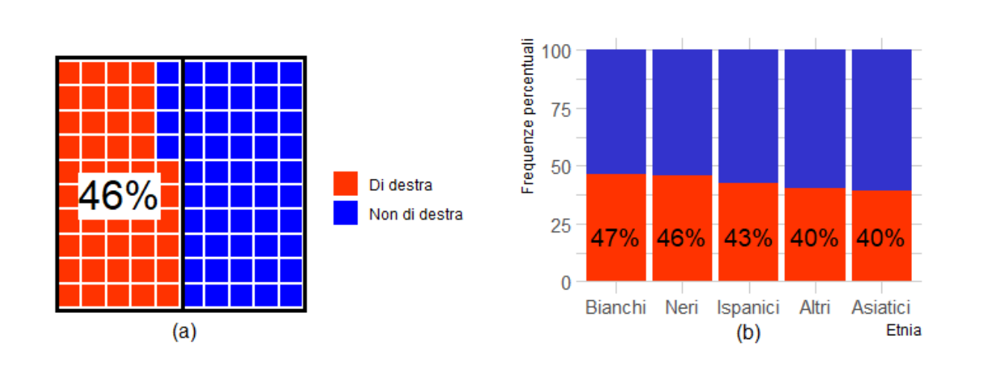
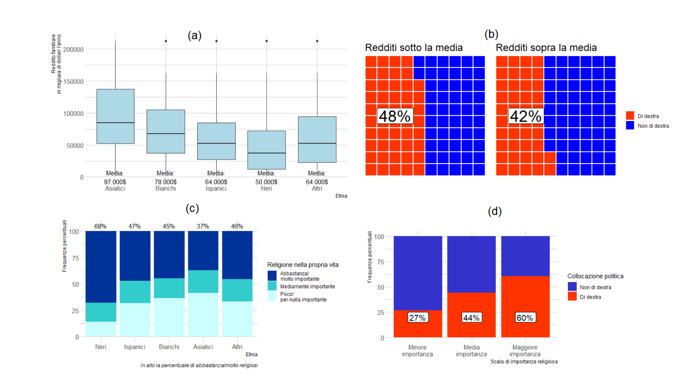
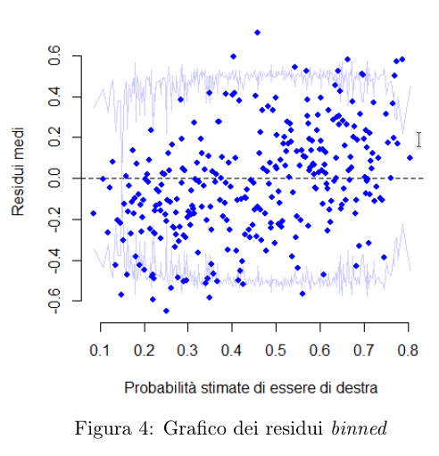
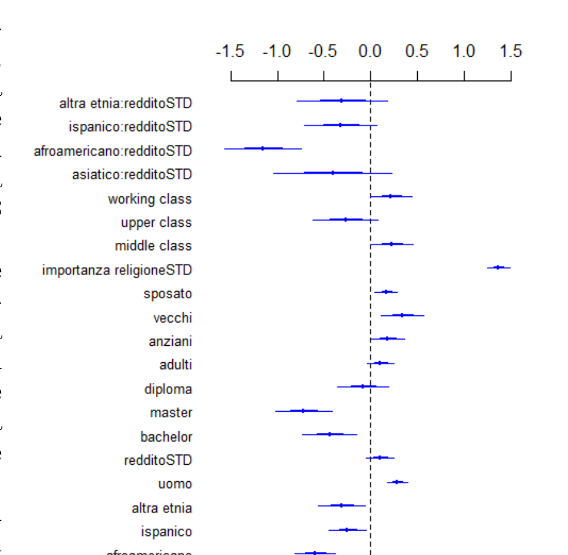
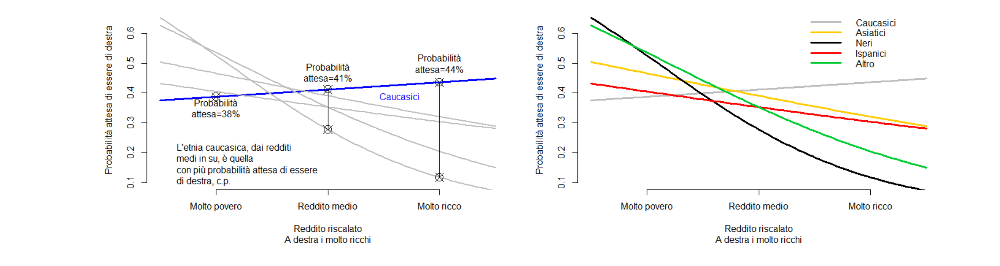

# What kind of vote for America's future?

*Federica Masci, Leonardo Rosetti, Luca Romano, Francesco Virgili, Marina Zanoni, Francesco Politano*
*December 25, 2024*

In the United States, every presidential election has traditionally pitted two candidates against each other, representing the country's two main parties: the Democratic Party (broadly "left-leaning") and the Republican Party ("right-leaning"). In the post-war period this "contest" has produced an almost perfectly balanced alternation (Figure 1): neither party has held the White House for more than 12 consecutive years, and overall the Republican Party has governed for 40 years against 30 for the Democratic Party.

**Figure 1:** Alternation of Democrats and Republicans in power from 1950 to today

This balance has also been possible thanks to the equilibrium between the two factions' electoral bases: neither has ever been able to rely on an overwhelming majority guaranteeing more than 3 consecutive victories. In the new millennium, however, the American electorate has gone through a phase of major change: today's electorate is more than 40 million people larger (+21%) than in 2000, and for the first time in decades the combined weight of baby boomers and the silent generation has fallen below 50%. Moreover, only a quarter of this increase involved individuals of Caucasian ethnicity.¹

At the same time, research and surveys show that the behavior of new voters is quite far from the equilibrium seen in the post-war United States. Younger generations clearly favor the Democratic Party, as do members of ethnic minorities, who are estimated to have accounted for over 40% of Biden's votes in the 2020 election,² despite making up less than a third of the overall electorate.

Any single election can also be decided by a candidate's personal appeal, which can attract (or repel) votes from social classes, ethnicities, and other groups even more than political affiliation does. Yet even the best candidates would struggle if they belonged to a party holding minority positions and ideas in the country. Can we then say it is good news for an American left-wing party that the weight of ethnic minorities in the electorate is increasing, and that this could allow the Democrats to open an era of consistent electoral victories? Even in a historical period like this one, in which, according to many studies, the left collects fewer votes among the most disadvantaged social classes?³

To answer this question, we analyze political self-placement using data from the 2020 ANES election survey, assessing how many individuals in the sample place themselves on the right⁴, and whether — beyond the Trump/Biden contest — different ethnic groups hold different views.

**Figure 2: The most conservative ethnicity is the Caucasian one**

As Figure 2, panel (a) shows, considering the whole sample, we see that conservative individuals alone do not make up an absolute majority of respondents (they are 46%). Looking in more detail, panel (b) shows that the same pattern repeats within each ethnic group. Specifically, **white respondents** are the most conservative ethnicity (47% identify as right-leaning), surprisingly not much more than **African Americans** (46%). By contrast, **Asians** and **Hispanics** show more progressive leanings (40% and 43% identify as right-leaning, respectively), together with other ethnic minorities (40%).

Without claiming equal conditions across groups, we might therefore conclude that African Americans are among the groups most inclined to elect right-wing presidents. Their ethnic group is also the **most religious** (68% attach quite a lot or a great deal of importance to faith in their life,⁵ Figure 3c) and the one with the **lowest average income** (more than 35% below the average of other groups, Figure 3a). Both of these characteristics are, however, already associated with a greater tendency to hold conservative positions: **60%** of those who attach quite a lot or a great deal of importance to religion are right-leaning (Figure 3d), just as **48%** of those with below-average household income are right-leaning (versus **42%** of those above average, Figure 3b). Only a logistic regression model can disentangle these "effects" through proper controls, and show how much of the difference in political preferences is driven by ethnicity itself rather than by confounding factors associated with both ethnicity and right-leaning preference.

The answer to whether ethnicity is a determining factor in voting preferences in the United States — and whether it is so independently of income — can therefore come from a model that controls for gender, importance attached to religion, marital status, education level, generation, employment status, and social class. The probability to be estimated is that of an individual identifying as right-leaning, given their endowment.

---

**Figure 3:** Average income by ethnicity (panel a), political leaning by income (panel b), importance of religion by ethnicity (panel c), political leaning as importance of religion varies (panel d)

### Regression model

$$\begin{array}{l} Pr\{y_i = 1 \mid X_i'\beta\} = \text{invlogit}\Bigg( \underset{(0.17)}{-0.36}\underset{(0.16)}{-0.09}\,\text{Asian}\underset{(0.11)}{-0.60}\,\text{African American}\underset{(0.10)}{-0.25}\,\text{Hispanic}\;\underset{(0.13)}{-0.31}\,\text{Other ethnicity} \\\\ \;\underset{(0.05)}{+0.28}\,\text{Male}\;\underset{(0.08)}{+0.10}\,\text{rescale(income)}\;\underset{(0.15)}{-0.72}\,\text{Master's degree}\;\underset{(0.14)}{-0.09}\,\text{High school diploma} \\\\ \underset{(0.15)}{-0.44}\,\text{Bachelor's degree}\;\underset{(0.07)}{+0.11}\,\text{Adults}\;\underset{(0.09)}{+0.18}\,\text{Seniors}\;\underset{(0.11)}{+0.34}\,\text{Elderly}\;\underset{(0.06)}{+0.17}\,\text{Married} \\\\ \;\underset{(0.06)}{+1.37}\,\text{rescale(religious importance)}\;\underset{(0.12)}{+0.23}\,\text{Middle class}\;\underset{(0.18)}{-0.27}\,\text{Upper class} \\\\ \underset{(0.11)}{+0.22}\,\text{Working class}\;\underset{(0.32)}{-0.41}\,\text{Asian} : \text{rescale(income)} \\\\ \;\underset{(0.20)}{-1.15}\,\text{African American} : \text{rescale(income)}\;\underset{(0.19)}{-0.32}\,\text{Hispanic} : \text{rescale(income)} \\\\ \;\underset{(0.24)}{-0.31}\,\text{Other ethnicities} : \text{rescale(income)}\Bigg) \end{array}$$

As can be seen from the formula, the **baseline** individual is a Caucasian woman, of average income, with education no higher than lower secondary school, aged 35 or under, unmarried, who attaches average importance to religion, and belongs to the lowest social class. Her expected probability of identifying as right-leaning is estimated at **41%**.

The control coefficients in the model are all logically significant: their "effects" on the outcome have the same sign one would expect from the literature and from the preceding descriptive analyses.

The **binned residuals** analysis shows no association between the estimated probability and the average residuals, as can be seen in the chart in Figure 4.

The null deviance is 8990, while using our model it drops to 8069. Relative to the null model's deviance, the residual deviance is therefore reduced by more than 900 points, so the model's pseudo-R² is 0.10.

**Figure 4:** Binned residuals plot

| (A) | ŷ = 0 | ŷ = 1 |
|---|---|---|
| **y = 0** | 0.39 | 0.16 |
| **y = 1** | 0.18 | 0.27 |

| (B) | ŷ = 0 | ŷ = 1 |
|---|---|---|
| **y = 0** | 0.54 | 0.00 |
| **y = 1** | 0.46 | 0.00 |

**Table 1:** Confusion matrix for the estimated model (A) and the null model (B)

Comparing with the null model (which classifies no individual as right-leaning), whose total error rate is **46%**, the fitted model succeeds in improving the analysis of political preferences, lowering the error rate to **34%**.

**Figure 5:** Coefficient estimates

As the curves in Figure 6 show — reporting the expected probability of identifying as right-leaning as household income and ethnicity vary — one cannot conclude that conservatives are always more successful among Caucasians than among ethnic minorities. In fact, this **stronger conservative tendency among white respondents** only appears among **individuals with household incomes above average** (roughly $65,000/year), and it is sharper among the very richest (above $250,000/year).

The probability of being right-leaning among Asian, African American, and Hispanic individuals is on average lower — by at most 2%, 15%, and 6% respectively — than for a Caucasian individual of average income, all else being equal. For individuals of other ethnicities, the probability is at most 8% lower. Among the **wealthiest** American voters, the right draws support from Asian, African American, and Hispanic individuals with probabilities lower by at most 12%, 44%, and 14% respectively compared to Caucasians (while other ethnicities have an expected probability lower by at most 15%).

Surprisingly, however, **poor white respondents** are the ones who, all else being equal, identify **least** as right-leaning: conservative Asians are 8 points higher, Black respondents 15 points higher, Hispanics 2 points higher.

A notable finding is that the **only ethnicity with a positive "income effect"** on the probability of identifying as right-leaning is the Caucasian one: wealthier white individuals are at most 3% more conservative than those with average income. Among the other ethnicities, by contrast, it is the **poor** who lean more toward the right: among Asians the expected difference in the probability of identifying as conservative between an extremely poor individual and one with average income is at most 13%, among African Americans 32%, among Hispanics 11%, and among others 11%. This is why the greatest income-driven polarization is found among African Americans, since they show the sharpest gap between rich and poor.

Turning to the other coefficients, the one with the **largest magnitude** concerns the **importance of religion** in one's life, as could already be anticipated from the differences in Figure 3 (panels c and d): between a moderately religious voter and a very religious one, the latter has an estimated probability of being right-leaning at most 34 points higher than the former.

Contrary to initial expectations of stronger left-wing support among minorities compared to Caucasians, all else being equal we found that there are in fact groups of **poorer voters** (Asian, Hispanic, and African American) who are **closer to conservative positions** than poor white voters are. The ongoing demographic changes in the United States are therefore not necessarily a guarantee of greater support for the Democratic Party in years to come, since this will also depend on the income levels these new voters will have (as the "effect" of income is by no means negligible today).

**Figure 6:** Expected probability curves of identifying as right-leaning for the baseline, for Caucasian ethnicity (A), and other ethnicities (B)

---

¹ https://www.pewresearch.org/2020/09/23/the-changing-racial-and-ethnic-composition-of-the-u-s-electorate/
² https://www.pewresearch.org/politics/2021/06/30/behind-bidens-2020-victory/
³ Luca Ricolfi, "Il grande swap" in *La mutazione*, 22-40. Rizzoli, 2022
⁴ i.e., those scoring at least 6 on a scale from 0 to 10, left to right
⁵ higher scores on a 1–5 scale for importance attached to religion; in the recoding, scores increase with importance
